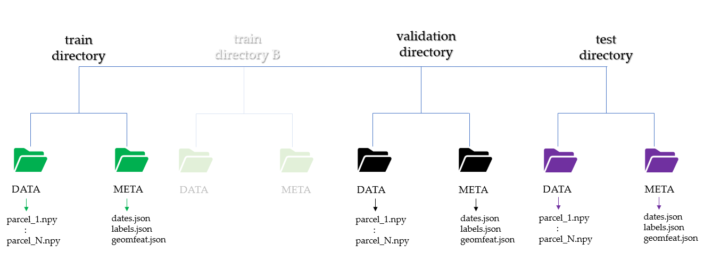
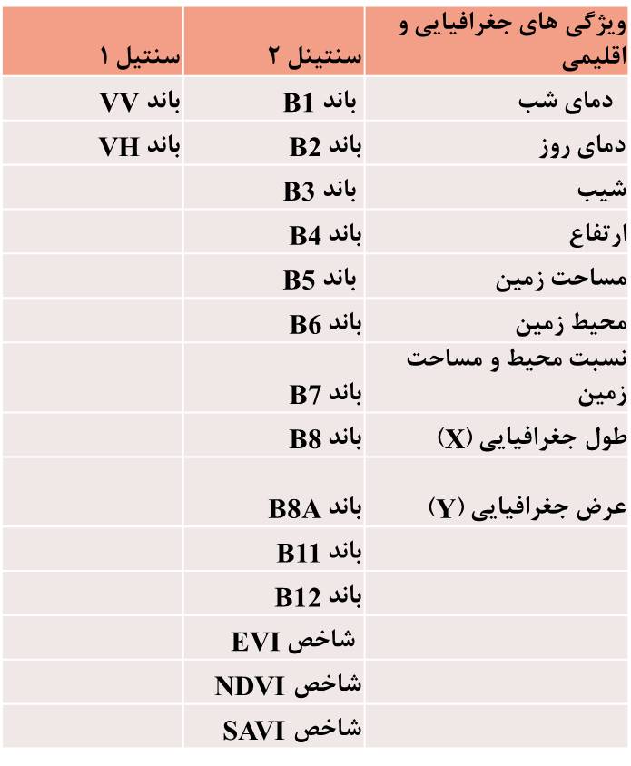

# Five Models
This repository explores five deep learning models, drawing inspiration from the methodologies outlined in [Paper1] (https://www.mdpi.com/2072-4292/13/22/4668)  and [Paper2] (https://arxiv.org/abs/1911.07757).
To facilitate experimentation and further research, code for both inference and transfer learning is included. 

## Requirements
- pytorch + torchnet + torchinfo
- numpy + pandas + sklearn + seaborn + JSON
- pickle + matplotlib

## Satellite data preparation
* prepare Block pixel of shape (```T x C x N ```) where;
    * T --> number of acquisitions
    * C --> number of channels/bands
    * N --> number of pixels within parcel
* organize time series array into separate folders from training, validation and testing

## Folder structure
The root folder should contain Sentinel-1 and Sentinel-2 directory named ```s1_data ``` and ```s2_data ```. Their sub-directories must be similar to the structure in the figure below


## Features of data
The dataset comprises data from various provinces in Iran, collected across two seasons. The specific features included in the dataset are detailed below.


## Code 

### Code structure
- The PyTorch implementations of the EARLY, PSE, TAE, SOFT_AVG, and ConvLSTM architectures are located in the `models` folder. 
- The folder `learning` contains some additional utilities that are used for training and testing like weight_init and metrics. 
- The repository also contains three high-level scripts `crop_ss_pse.py`, `crop_INF_ss_pse.py` and `crop_TL_ss_pse.py` for simple training, inference and transfer learning. 
- For making dataset `dataset_fusion.py` is prepared 

### Code Usage 

#### Simple Training
For basic training, you can leverage the `crop_ss_pse.py` script. Simply provide the script with the paths to your training, validation, and test datasets, along with the desired model and its hyperparameters.

#### Inference
For model inference, you can utilize the `crop_INF_ss_pse.py` script. Simply provide the script with the path to the directory containing the trained model weights.

#### Transfer Learning
The `crop_TL_ss_pse.py` script facilitates transfer learning. Specify the path to the directory containing the pre-trained model weights and indicate which layers you want to freeze during the fine-tuning process.

