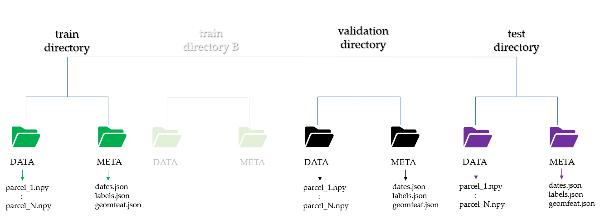

# Crop Classification(Deep Learning)
This repository explores five deep learning models, drawing inspiration from the methodologies outlined in [Paper1](https://www.mdpi.com/2072-4292/13/22/4668) and [Paper2](https://arxiv.org/abs/1911.07757).
To facilitate experimentation and further research, code for both inference and transfer learning is included. 

## Requirements
- Python 3.x
- pytorch 2.4.1
- numpy + pandas + sklearn + seaborn + JSON
- pickle + matplotlib

## Satellite data preparation
* prepare Block pixel of shape (```T x C x N ```) where;
    * T --> number of acquisitions
    * C --> number of channels/bands
    * N --> number of pixels within parcel
* organize time series array into separate folders from training, validation and testing

## Folder structure
The root folder should contain Sentinel-1 and Sentinel-2 directory named ```s1_data ``` and ```s2_data ```. Their sub-directories must be similar to the structure in the figure below



## Features of data
The dataset comprises data from various provinces in Iran, collected across two seasons. The specific features included in the dataset are detailed below.


## Code 

### Code structure
- The PyTorch implementations of the EARLY, PSE, TAE, SOFT_AVG, and ConvLSTM architectures are located in the `models` folder. 
- The folder `learning` contains some additional utilities that are used for training and testing like weight_init and metrics. 
- The repository also contains three high-level scripts `run_main.py`, `run_inference.py` and `run_transferlearning.py` for simple training, inference and transfer learning. 
- For making dataset `dataset_fusion.py` is prepared 

### Code Usage 

#### Simple Training
For basic training, you can leverage the `run_main.py` script. In this script, the desired model is executed by calling the run_main function and setting values for similar items, data path, result storage path, model, etc.

#### Inference
For model inference, you can utilize the `run_inference.py` script. In this script, inference is performed by calling the run_inference function and setting values from the same centers, evaluation data path, stored weights, path storage results, model, etc.

#### Transfer Learning
The `run_transferlearning.py` script facilitates transfer learning. In this script, by calling the run_transferlearning function and setting values like data path, stored weights path, result storage path, model, etc., transfer learning models are executed.

## Example Usage

```python

## run_main
run_main(train_path, validation_path, test_path, mean_std_s1_path, mean_std_s2_path, save_result_path,
              model_name,epoch, batch_sizee)

    """
    this function is for simple run
    
    Parameters:
    - train_path: path to the train dataset
    - validation_path: path to the validation dataset
	- test_path: path to the test dataset
	- mean_std_s1_path: path to the mean-std-s1 file
	- mean_std_s2_path: path to the mean-std-s2 file
	- save_result_path: path for save_result
	- model_name: chose model
	- epoch: number of epochs
	- batch_sizee: number of batch size
	
    """


## run_inference
run_inference(test_path, mean_std_s1_path, mean_std_s2_path, weight_path, save_result_path,
              model_name, batch_sizee)

    """
    this function is for inference
    
    Parameters:

	- test_path: path to the test dataset
	- mean_std_s1_path: path to the mean-std-s1 file
	- mean_std_s2_path: path to the mean-std-s2 file
	- weight_path: path to the stored weight
	- save_result_path: path for save_result
	- model_name: chose model
	- batch_sizee: number of batch size
	
    """

## run_transferlearning
run_transferlearning(train_path, validation_path, test_path, mean_std_s1_path, mean_std_s2_path,weight_path, save_result_path,
              model_name,epoch, batch_sizee)

    """
    this function is for Transfer learning
    
    Parameters:
    - train_path: path to the train dataset
    - validation_path: path to the validation dataset
	- test_path: path to the test dataset
	- mean_std_s1_path: path to the mean-std-s1 file
	- mean_std_s2_path: path to the mean-std-s2 file
	- weight_path: path to the stored weight	
	- save_result_path: path for save_result
	- model_name: chose model
	- epoch: number of epochs
	- batch_sizee: number of batch size
	
    """

```
